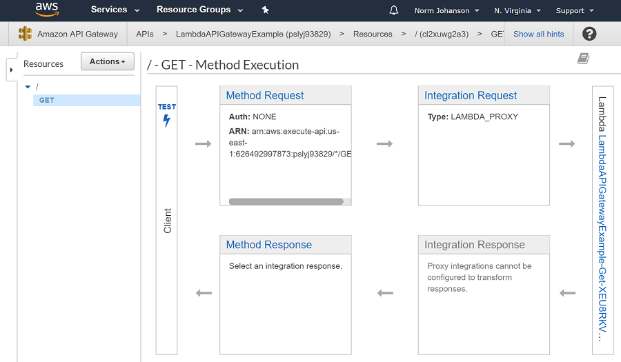
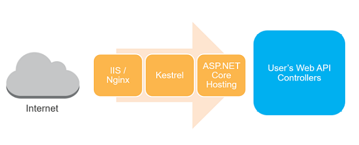
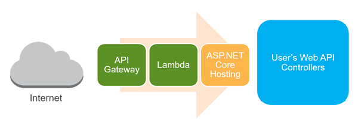

# ASP.NET Core as a Lambda Function?

When you want to expose a Lambda function to the web you register the Lambda function to either an API Gateway REST api or an ELB Application Load Balancer.
The http request that come into the REST API or the Application load balancer will sent to the Lambda function as events just like we saw earlier with
the DynamoDB stream sample. The man difference is that a response object is returned from the Lambda function which will be returned back as the HTTP response
through API Gateway or Application Load Balancer.

For this tutorial we will use API Gateway to expose our Lambda function.


## Basic API Gateway Lambda Function

Typically if you are writing a Lambda function to be exposed through API Gateway you write a function that takes in a **APIGatewayProxyRequest**
and returns back a **APIGatewayProxyResponse**. If the method is using async operations it would return back **Task&lt;APIGatewayProxyResponse&gt;**. 

```csharp
public APIGatewayProxyResponse Get(APIGatewayProxyRequest request, ILambdaContext context)
{
    context.Logger.LogLine("Get Request\n");

    var response = new APIGatewayProxyResponse
    {
        StatusCode = (int)HttpStatusCode.OK,
        Body = "Hello AWS Serverless",
        Headers = new Dictionary<string, string> { { "Content-Type", "text/plain" } }
    };

    return response;
}
```

For the REST API defined in API Gateway you map the HTTP resource path and verb to the Lambda function you want to call.




## ASP.NET Core application as a Lambda Function

It is possible to run an ASP.NET Core application as a Lambda function. This is possible with the [Amazon.Lambda.AspNetCoreServer](https://www.nuget.org/packages/Amazon.Lambda.AspNetCoreServer/)
NuGet package.

This package contains a method similar to the one above that takes in the **APIGatewayProxyRequest** and returns back a **APIGatewayProxyResponse**.
The method converts the APIGatewayProxyRequest into an ASP.NET Core request. Then forwards the request into our ASP.NET Core application and
transforms the ASP.NET Core response into the required **APIGatewayProxyResponse**.

At a high level it basically changes the typical ASP.NET Core Kestrel server scenario



into this replacing Kestrel with API Gateway and Lambda.




## Is ASP.NET Core on Lambda an AntiPattern?

There are similar adaptors like Amazon.Lambda.AspNetCoreServer for other languages. For example there is a Spring adaptor for Java and an Express adaptor for
Node.js. The serverless community is divided on whether this is an antipattern as the common intention is to use Lambda for microservices and bringing in 
these large web frameworks can go against that idea.

Here is my take as the author of this tutorial and the author of Amazon.Lambda.AspNetCoreServer but feel free to disagree. I believe there is never
just one solution for all problems/scenarios. For some teams that want the benefit of the scaling and pricing model of serverless but have invested
a lot of energy and time in ASP.NET Core, whether that is education or existing codebase, using the adaptor makes sense. For those that aren't as
invested in ASP.NET Core and are ready to design and manage a distributed microservice architecture then skip using Amazon.Lambda.AspNetCoreServer.

ASP.NET Core has one big advantage over the other web framework adaptors and that ASP.NET Core is already builted into
.NET Core running in the Lambda environment. So the deployment bundle will not be excessively large. There are some limitations 
in the environment. For example the request and response sizes are limited to 6MB at the time of this writing. This adaptor is not meant 
for bringing huge monolithic ASP.NET Core applications that take a long time to start up. Cold starts can
be an issue so you should limit what is done during the Startup class's initialization. If you want to take advantage of the great features
in ASP.NET Core and other support the .NET ecosystem has added to ASP.NET Core then using this package is a great way to get
started with Serverless without having to completely rethink how you built applications.

Another benefit of using this package is it gives you options on how to build and deploy. As we have seen we have an ASP.NET Core application
that we can easily run and test locally. This same code we can choose to deploy to either Lambda, Containers or Elastic Beanstalk for a traditional
IIS deployment. We didn't have to make architecture decisions to our software that limited how we want to deploy the application.

One final recommendation. The ASP.NET Core adaptor is most commonly used for Web APIs, if you are using it for a full application and have a lot
of static content I recommend pushing the static content to an S3 bucket. The API Gateway REST API can be configured to forward request to the S3 
Bucket for static content resource paths like **images**, **lib**  and **css** to forward to the S3 bucket. That is beyond the scope of this tutorial.

<!-- Generated Navigation -->
---

* [Getting Started](../GettingStarted.md)
* [What is a serverless application?](../WhatIsServerless.md)
* [Common AWS Serverless Services](../CommonServerlessServices.md)
* [What are we going to build in this tutorial](../WhatAreWeBuilding.md)
* [TODO List AWS Services Used](../TODOListServices.md)
* [Using DynamoDB to store TODO Lists](../DynamoDBModule/WhatIsDynamoDB.md)
* [Handling service events with Lambda](../StreamProcessing/ServiceEvents.md)
* [Getting ASP.NET Core ready for Serverless](../ASP.NETCoreFrontend/TheFrontend.md)
* [Deploying ASP.NET Core as a Serverless Application](../DeployingFrontend/DeployingFrontend.md)
  * **ASP.NET Core as a Lambda Function?**
  * [Preparing for Lambda Deployment](../DeployingFrontend/LambdaPrepare.md)
  * [Deploy to Lambda using CloudFormation](../DeployingFrontend/LambdaDeploy.md)
  * [What is for Fargate](../DeployingFrontend/WhatIsFargate.md)
  * [Deploying to Fargate](../DeployingFrontend/FargateDeploy.md)
* [Tear Down](../TearDown.md)
* [Final Wrap Up](../FinalWrapup.md)

Continue on to next page: [Preparing for Lambda Deployment](../DeployingFrontend/LambdaPrepare.md)

