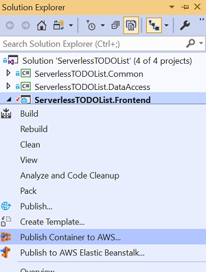
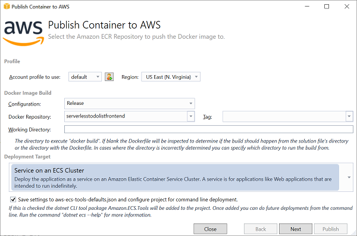
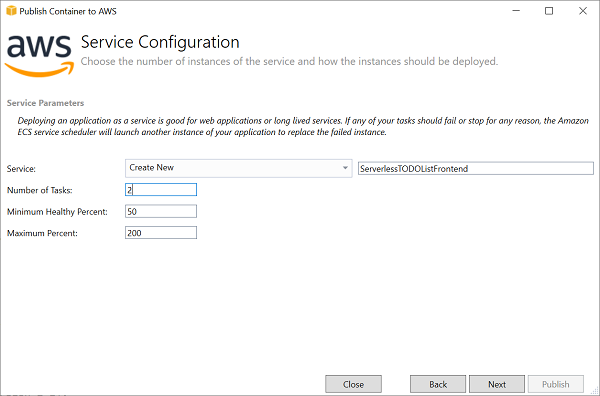

# Deploying to Fargate


## AWS Identity and Access Management (IAM) Role

When the application is deployed to Fargate an IAM role is required. The role provides AWS credentials to the container
that can be used to access other AWS services. When you construct a service client from the 
AWS SDK for .NET without specifing credentials the SDK will locate the credentials for the assigned role.

Our application needs access to DynamoDB, Systems Manager and Cognito. Fargate will log messages written to standard out 
and standard error to CloudWatch Logs so make sure the IAM role we use during deployment has access to 
CloudWatch Logs to the IAM role.

If you don't have an IAM role that has the required permissions then skip down to the [Create Role](#create-role)
section at the bottom of this page to create an IAM role and then return back here.


## Adding Dockerfile


To deploy to Fargate Docker must be installed and running on our machine. The next step is the **ServerlessTODOList.Frontend**
project needs to have a **Dockerfile** in it to tell Docker how to build ServerlessTODOList.Frontend as a Docker image.

In Visual Studio a quick way to create a Dockerfile that right click on the ServerlessTODOList.Frontend project and
select **Add -> Docker Support**.


That will create a Dockerfile in the project with content below.

```
FROM mcr.microsoft.com/dotnet/core/aspnet:2.1-stretch-slim AS base
WORKDIR /app
EXPOSE 80
EXPOSE 443

FROM mcr.microsoft.com/dotnet/core/sdk:2.1-stretch AS build
WORKDIR /src
COPY ["ServerlessTODOList.Frontend/ServerlessTODOList.Frontend.csproj", "ServerlessTODOList.Frontend/"]
COPY ["ServerlessTODOList.Common/ServerlessTODOList.Common.csproj", "ServerlessTODOList.Common/"]
COPY ["ServerlessTODOList.DataAccess/ServerlessTODOList.DataAccess.csproj", "ServerlessTODOList.DataAccess/"]
RUN dotnet restore "ServerlessTODOList.Frontend/ServerlessTODOList.Frontend.csproj"
COPY . .
WORKDIR "/src/ServerlessTODOList.Frontend"
RUN dotnet build "ServerlessTODOList.Frontend.csproj" -c Release -o /app

FROM build AS publish
RUN dotnet publish "ServerlessTODOList.Frontend.csproj" -c Release -o /app

FROM base AS final
WORKDIR /app
COPY --from=publish /app .
ENTRYPOINT ["dotnet", "ServerlessTODOList.Frontend.dll"]
```

## Deployment Wizard

Now that the project file has a Dockerfile when we right click on the ServerlessTODOList.Frontend project we will
see a new menu item to **Publish Container to AWS...**.



### Wizard page 1 - Set deployment type




### Wizard page 2 - Fargate configuration


### Wizard page 3 - ECS service configuration



### Wizard page 4 - Application Load Balancer configuration


### Wizard page 5 - Task Definition configuration


## ECS Cluster View


## Create Role

This code can be used to create an IAM Role with the appropriate permissions required for 
the ServerlessTODOList.Frontend running in Fargate. If you already have a role then this
section is not necessary. If you do run this code it will create an IAM role called **ECS-ServerlessTODOList.Frontend**
that can be selected for the IAM role during the Fargate deployment.

```cs --source-file ../Snippets/IAMRoleSetups.cs --project ../Snippets/Snippets.csproj --region setup_ecs_frontend_role
```

<!-- Generated Navigation -->
---

* [Getting Started](../GettingStarted.md)
* [What is a serverless application?](../WhatIsServerless.md)
* [Common AWS Serverless Services](../CommonServerlessServices.md)
* [What are we going to build in this tutorial](../WhatAreWeBuilding.md)
* [TODO List AWS Services Used](../TODOListServices.md)
* [Using DynamoDB to store TODO Lists](../DynamoDBModule/WhatIsDynamoDB.md)
* [Handling service events with Lambda](../StreamProcessing/ServiceEvents.md)
* [Getting ASP.NET Core ready for Serverless](../ASP.NETCoreFrontend/TheFrontend.md)
* [Deploying ASP.NET Core as a Serverless Application](../DeployingFrontend/DeployingFrontend.md)
  * [ASP.NET Core as a Lambda Function?](../DeployingFrontend/AspNetCoreAsLambda.md)
  * [Preparing for Lambda Deployment](../DeployingFrontend/LambdaPrepare.md)
  * [Deploy to Lambda using CloudFormation](../DeployingFrontend/LambdaDeploy.md)
  * [What is for Fargate](../DeployingFrontend/WhatIsFargate.md)
  * **Deploying to Fargate**
* [Final Wrap Up](../FinalWrapup.md)

Continue on to next page: [Final Wrap Up](../FinalWrapup.md)

