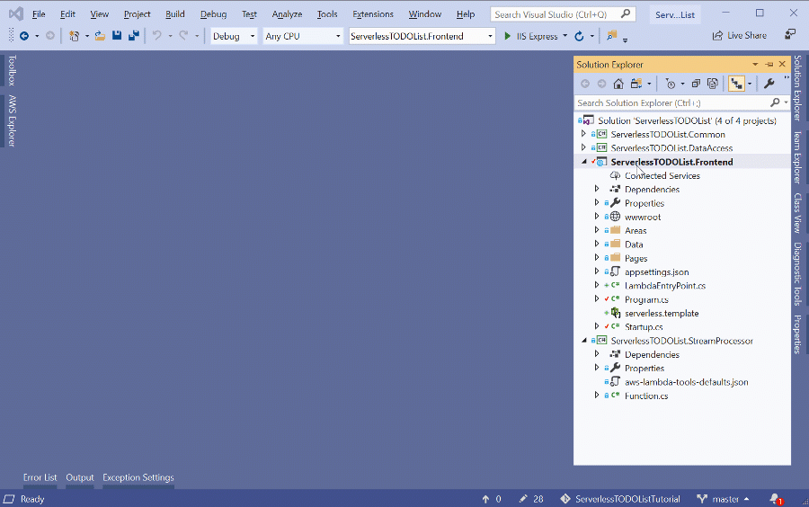
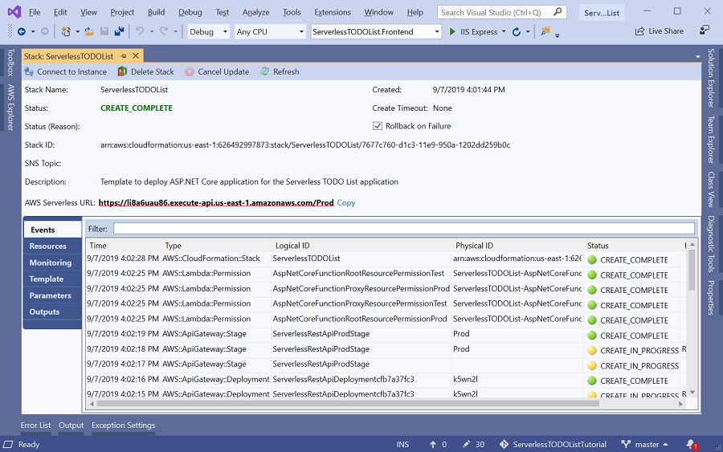

# Deploy to Lambda using CloudFormation

To deploy the Lambda function we can use either the [AWS Toolkit for Visual Studio](https://marketplace.visualstudio.com/items?itemName=AmazonWebServices.AWSToolkitforVisualStudio2017) or the 
[Amazon.Lambda.Tools](https://github.com/aws/aws-extensions-for-dotnet-cli#aws-lambda-amazonlambdatools) .NET Core global tool.

When we deployed the DynamoDB Stream Lambda function we had to create an IAM role before deploying. This time our IAM role will be created as part of the CloudFormation template.

## Visual Studio

In the solution explorer right click on the **ServerlessTODOList.Frontend** project and select 
**Publish to AWS Lambda**. This will launch the deployment wizard.


Notice the wizard page is different compared to when we deployed the DynamoDB Stream Lambda function. The wizard has detected there is a CloudFormation template in the project
and has switched mode for a CloudFormation based deployment.

### Stack Name
The Stack Name field will be used to name the CloudFormation stack. A CloudFormation stack is the container for all of the resources that will be created as defined by
the CloudFormation template. Lets call our stack **ServerlessTODOList**.

### S3 Bucket
The name of an S3 bucket must be set and the bucket must be in the same region as the CloudFormation stack will be created in. When the deployment happens the **ServerlessTODOList.Frontend**
will be compiled, zipped up and upload to this S3 bucket. The CloudFormation template will then be updated to point the Lambda function defined in the template to point to the compiled
code in the S3 bucket.

### Profile and Region
Be sure the profile and region are set to the profile and region that was set at the beginning of the tutorial and is where
the DynamoDB table was created.

### CloudFormation Parameters
CloudFormation templates can defined parameters. In our case there are no parameters defined but if there were a second page would be added to the wizard to allow setting the
template parameters.


### Push Publish
When the wizard fields are set push the **Publish** to start the deployment. This will be build the project and upload the built project to S3. Then update the CloudFormation template
to point to the S3 location. With the updated CloudFormation template it will tell CloudFormation to create the Stack.



After the wizard initiates the CloudFormation stack creation the wizard disappears and displays the view of the CloudFormation stack. The view will start scrolling events as 
resources from the template start getting created.  Once the stack is created the URL to our deployed serverless application will be displayed. Go ahead and click on the link
and test out our serverless TODO list application.



## Amazon.Lambda.Tools .NET Core Global Tool

If you don't have Visual Studio or you want to automate the deployment the **Amazon.Lambda.Tools** .NET Core Global Tool can be used.

You should have **Amazon.Lambda.Tools** already installed from the DynamoDB Stream section but if not execute the following command.

```
dotnet tool install -g Amazon.Lambda.Tools
```

When the DynamoDB Stream function was deployed we use the subcommand `deploy-function` to deploy straight to the Lambda service. Now
that we are deploy with CloudFormation we need to use the `deploy-serverless` subcommand.

The command below will deploy the function and create a CloudFormation stack called ServerlessTODOList.

Before we run this lets look at the arguments passed into the **deploy-serverless** subcommand.

| Argument | Description|
|-|-|
| `--s3-bucket <bucket-name>` | The name of an S3 bucket in the same region the application will be deployed to. The bucket is used to store the compiled project that the CloudFormation template will point to. |
| `--profile <profile-name>` | The name of the AWS profile set at the beginning of the tutorial. |
| `--region <region-name>` | The AWS region that the application will be deploy in like us-east-1 |
| `--persist-config-file true` | Optional argument so that all of the arguments used during deployment will be saved into the **aws-lambda-tools-defaults.json** file.


Now run the following command in the directory of ServerlessTODOList.Frontend filling in the values 
for --s3-bucket, --profile and --region.

```
dotnet lambda deploy-serverless ServerlessTODOList --s3-bucket <bucket-name> --profile <profile-name> --region <region-name> --persist-config-file true
```


<!-- Generated Navigation -->
---

* [Getting Started](../GettingStarted.md)
* [What is a serverless application?](../WhatIsServerless.md)
* [Common AWS Serverless Services](../CommonServerlessServices.md)
* [What are we going to build in this tutorial](../WhatAreWeBuilding.md)
* [TODO List AWS Services Used](../TODOListServices.md)
* [Using DynamoDB to store TODO Lists](../DynamoDBModule/WhatIsDynamoDB.md)
* [Handling service events with Lambda](../StreamProcessing/ServiceEvents.md)
* [Getting ASP.NET Core ready for Serverless](../ASP.NETCoreFrontend/TheFrontend.md)
* [Deploying ASP.NET Core as a Serverless Application](../DeployingFrontend/DeployingFrontend.md)
  * [ASP.NET Core as a Lambda Function?](../DeployingFrontend/AspNetCoreAsLambda.md)
  * [Preparing for Lambda Deployment](../DeployingFrontend/LambdaPrepare.md)
  * **Deploy to Lambda using CloudFormation**
  * [Preparing for Fargate (Container) Deployment](../DeployingFrontend/FargatePrepare.md)
  * [Deploying to Fargate](../DeployingFrontend/FargateDeploy.md)
* [Final Wrap Up](../FinalWrapup.md)

Continue on to next page: [Preparing for Fargate (Container) Deployment](../DeployingFrontend/FargatePrepare.md)

