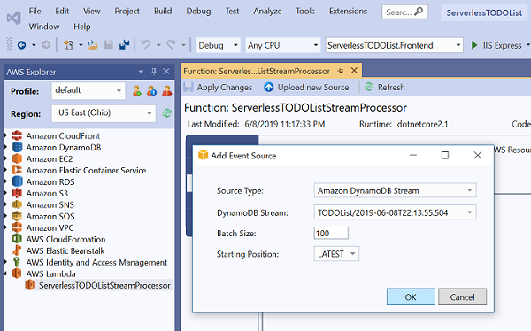

# Configuring DynamoDB as an event source

Now that we have our DynamoDB Stream enabled and our Lambda function deployed it is time to tie them together. 
This is called adding an event source to Lambda function. The event source can be configured in the AWS Lambda Console
or the AWS Toolkit for Visual Studio.

## Configuring with AWS Toolkit for Visual Studio

After the Lambda function was deployed the Lambda function view was displayed from the AWS Explorer. From this view
you can create the event source mapping by:

1. Select the **Event Sources** tab
2. Push the **Add** button
3. Select **Amazon DynamoDB Stream** for the Source Type
4. Make sure the Stream we enabled previously is selected for the DynamoDB Stream
5. Set the **Starting Position** to **LATEST**
5. Push OK

Note: Batch Size and Starting Position can be left at the default values. Starting Position has 2 possible values. 
TRIM_HORIZON basically means start reading from the stream at the earliest point still available in the stream. 
This is at most 24 hours in the past.
LATEST means start reading items starting from the point the mapping event source was made.



## Configuring with AWS Lambda Console

Instructions for configuring with the AWS Lambda Console:

1. Log on to the [AWS Lambda Lambda Console](https://us-east-2.console.aws.amazon.com/lambda/home)
2. Choose the region you deployed to
3. Select the deployed function
4. In the **Add triggers** panel select DynamoDB
5. In the **Configure triggers** below select the DynamoDB table and push **Add**
6. Push the **Save** button for the Lambda function


## Configuring with the AWS SDK for .NET

As an example of how to use the AWS SDK for .NET the code below shows how to add the event source. You must
set the name of the function that you deployed earlier to the **functionName** variable.

```cs --source-file ../Snippets/ConfigureEventSourceMapping.cs --project ../Snippets/Snippets.csproj --region add_dynamodb_event_source
```

<!-- Generated Navigation -->
---

* [What is a serverless application?](../WhatIsServerless.md)
* [Common AWS Serverless Services](../CommonServerlessServices.md)
* [TODO List AWS Services Used](../TODOListServices.md)
* [Using DynamoDB to store TODO Lists](../DynamoDBModule/WhatIsDynamoDB.md)
* [Using Lambda to Handle Service Events](../StreamProcessing/ServiceEvents.md)
  * [TODO List Task Assignments](../StreamProcessing/TODOTaskListAssignment.md)
  * [Enable DynamoDB Stream](../StreamProcessing/EnableDynamoDBStream.md)
  * [Assign Task Lambda Function](../StreamProcessing/LookAtLambdaFunction.md)
  * [Deploy Lambda Function](../StreamProcessing/DeployLambdaFunction.md)
  * [Setting up Amazon Simple Email Service (SES)](../StreamProcessing/SettingUpSES.md)
  * **Configuring DynamoDB as an event source**

