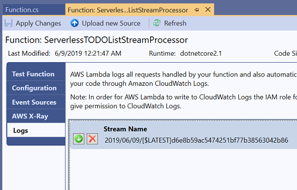

# Tips for troubleshooting Lambda functions

If your Lambda function is not working as expected here are some tips to help understand what is going on.

## CloudWatch Logs

In .NET Core Lambda functions all calls to **ILambdaContext.Logger.LogLine** as well as all **Console.Write** calls will
be captured by the Lambda service and recorded into CloudWatch Logs. The Log Group assigned to the Lambda function will
follow the pattern `/aws/lambda/<function-name>`.

If you are using the AWS Toolkit for Visual Studio then from the function view you can view logs from the **Logs** tab. 
Push on the green download button to view the logs. There is a few seconds delay from when the .NET code in the Lambda
function write the log message to when it will show up in this view. If you don't see the expected messages keep pushing
the **Refresh** button.

## Replaying events in Visual Studio

The [AWS .NET Mock Lambda Test Tool](https://github.com/aws/aws-lambda-dotnet/tree/master/Tools/LambdaTestTool)
allows you to replay events with a .NET debugger attached. For Visual Studio users this tool will be automatically
configured for Lambda projects when they are opened. For other .NET IDEs, like Visual Studio for Code,
checkout the [README.md](https://github.com/aws/aws-lambda-dotnet/tree/master/Tools/LambdaTestTool) for instructions
on how to configure the tool for it.

To capture the Lambda JSON event object so that it can be replayed locally, redeploy the Lambda function
with the **LAMBDA_NET_SERIALIZER_DEBUG** environment variable set to **true**. Once this environment variable is set the 
JSON event will be written to the CloudWatch Log. Copy the event from the log and past it into the **Function Input** 
text box and push **Execute Function**.

<!-- Generated Navigation -->
---

* [Getting Started](../GettingStarted.md)
* [What is a serverless application?](../WhatIsServerless.md)
* [Common AWS Serverless Services](../CommonServerlessServices.md)
* [What are we going to build in this tutorial](../WhatAreWeBuilding.md)
* [TODO List AWS Services Used](../TODOListServices.md)
* [Using DynamoDB to store TODO Lists](../DynamoDBModule/WhatIsDynamoDB.md)
* [Handling service events with Lambda](../StreamProcessing/ServiceEvents.md)
  * [TODO List Task Assignments](../StreamProcessing/TODOTaskListAssignment.md)
  * [Enable DynamoDB Stream](../StreamProcessing/EnableDynamoDBStream.md)
  * [Assign Task Lambda Function](../StreamProcessing/LookAtLambdaFunction.md)
  * [Deploy Lambda Function](../StreamProcessing/DeployLambdaFunction.md)
  * [Setting up Amazon Simple Email Service (SES)](../StreamProcessing/SettingUpSES.md)
  * [Configuring DynamoDB as an event source](../StreamProcessing/ConfigureLambdaEventSource.md)
  * [Testing Lambda Function](../StreamProcessing/TestingLambdaFunction.md)
  * **Tips for troubleshooting Lambda functions**
  * [Stream processing wrap up](../StreamProcessing/StreamProcessingWrapup.md)
* [Getting ASP.NET Core ready for Serverless](../ASP.NETCoreFrontend/TheFrontend.md)
* [Deploying ASP.NET Core as a Serverless Application](../DeployingFrontend/DeployingFrontend.md)
* [Final Wrap Up](../FinalWrapup.md)

Continue on to next page: [Stream processing wrap up](../StreamProcessing/StreamProcessingWrapup.md)

